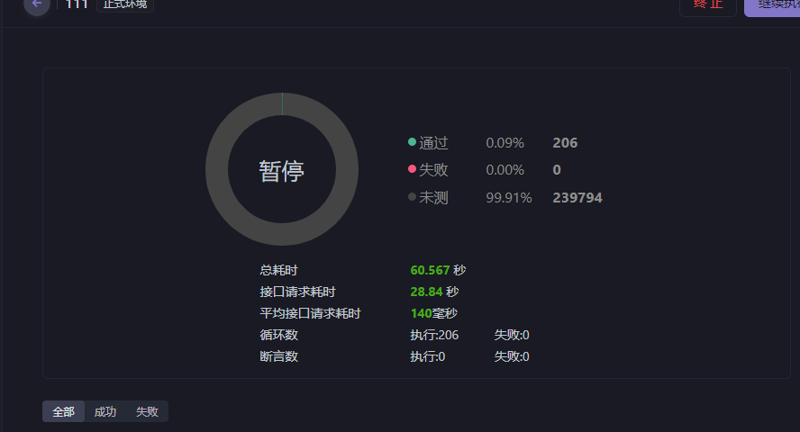

 该项目是我在学习spring-cloud-alibaba的时候编写的一个模仿12306的售票项目，该项目使用了微服务的组件构建了这样一个售票系统（完善中），该项目实现了基础的购票功能、火车车次管理功能、火车每日车次的自动生成功能(使用定时调度框架quartz来实现),由于是spring-cloud练手项目，本人使用了许多spring-cloud微服务组件来实现该项目，并保证了该项目的高可用性，以下是该项目的技术介绍：

  

项目架构图
  

## 架构设计
#### 后端：
该项目的后端部分我分了5个模块  
1、gateway网关模块负责，实现路由，进行总体接口的权限、黑白名单验证与拦截  
2、member模块用于处理用户账号以及乘车人的信息管理  
3、business模块负责处理业务逻辑，也是该项目最核心的逻辑，负责火车、车站、车次、车票等信息的管理，并负责订票的逻辑  
4、batch模块负责定时任务的调度处理，主要是用来设置并执行定时任务，执行任务的方式是通过openFeign调用别的模块来实现逻辑  
5、common模块该模块用来存放一些公共的类，如工具类、公共的拦截器、公共的controller公共的全局异常处理器、公共的请求与响应实体等  

#### 前端：
前端构建了两个端
1、用户端，用来管理乘客信息与进行查看车次与购票操作
2、控制台端，用来处理火车车次等基本信息，以及火车车次每日定时生成系统的设置

#### 数据库
该项目构建了四个数据库  
  
1、seata是中间件seata所需要的数据库  
2、train_batch是存储quartz框架定时任务信息的数据库  
3、train_business存放火车相关信息以及订单相关信息
4、train_member存放会员、乘车人的信息、车票信息

## 使用到的技术展示
###  springcloud-alibaba
Nacos注册中心  
Nacos配置中心  
Seata分布式事务  
Sentinel限流降级  
Feign服务调用  
###  第三方组件集成
Mybatis  
Redis  
RocketMQ  
Quartz  
### 使用到的高并发技术
缓存  
限流、熔断  
令牌  
令牌大闸  
削峰填谷  
分布式锁  
###  前端
Vue3  
Axios  
Router  
Vuex  
Ant Design Vue  
多环境配置  
编译与部署  

### 项目使用
将源码下载，sql建表语句在根目录的sql当中  
中间件：rocketMQ、redis、mysql、seata、nacos、sentinel dashboard 需要自己下载
### 项目部分页面截图：
  
  
  

## 缓存设计效率对比（使用购票时余票查询的接口为例子）

## Sharding-sphere分库分表策略

两个数据源，分别是ds0和ds1，每个数据源都连接到一个MySQL数据库。  您配置了12个逻辑表，每个逻辑表都配置了分库和分表策略。这些逻辑表包括：  
confirm_order
daily_train
daily_train_carriage
daily_train_seat
daily_train_station
daily_train_ticket
station
train
train_carriage
train_seat
train_station
train_token
每个逻辑表都被分为两个实际的数据节点，分别位于ds0和ds1数据源中。每个数据节点又被分为**两个表**。  

分库策略是基于id字段的，使用的是database_inline_id分片算法，该算法是一个内联表达式分片算法，通过id字段的奇偶性来决定分配到哪个数据源。  分表策略也是基于id字段的，使用的是order_table_inline_id分片算法，该算法也是一个内联表达式分片算法，通过id字段的奇偶性来决定分配到哪个表。 

采用windows与WSL2两个服务器上进行部署

